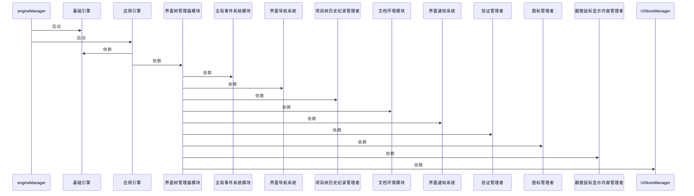

```mermaid
sequenceDiagram
  engineManager->>基础引擎: 启动
  engineManager->>应用引擎: 启动
  应用引擎->>基础引擎: 依赖
  应用引擎->>界面树管理器模块: 依赖
  界面树管理器模块->>全局事件系统模块: 依赖
  界面树管理器模块->>界面导航系统: 依赖
  界面树管理器模块->>项目树历史纪录管理者: 依赖
  界面树管理器模块->>文档环境模块: 依赖
  界面树管理器模块->>界面通知系统: 依赖
  界面树管理器模块->>验证管理者: 依赖
  界面树管理器模块->>图标管理者: 依赖
  界面树管理器模块->>跟随鼠标显示内容管理者: 依赖
  界面树管理器模块->>UIStoreManager: 依赖
```
