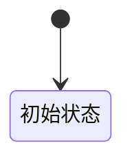
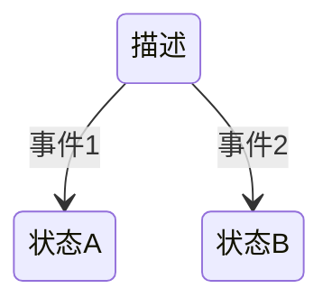
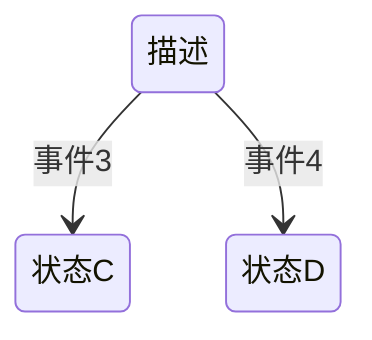
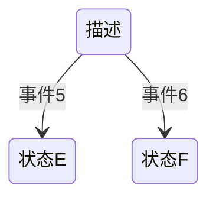
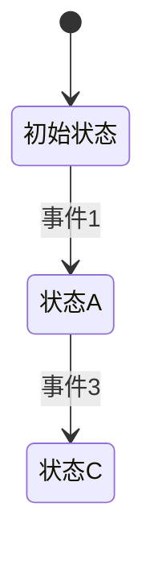
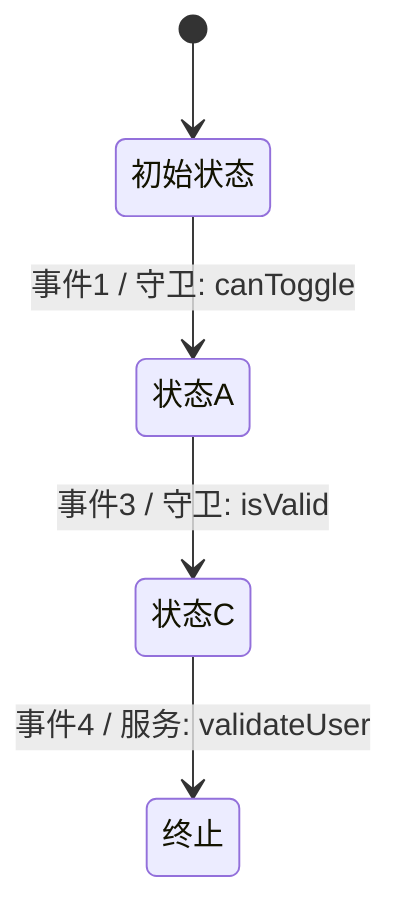

# 状态机名称

描述该状态机的功能和用途。

## 初始状态

描述状态机开始的状态。

## 状态

列出所有的状态和它们之间的转换。

### 初始状态

描述初始状态的行为和可能的转换。

### 状态A

描述状态A的行为和可能的转换。

### 状态B

描述状态B的行为和可能的转换。

### 其他状态

继续列出其他状态及其转换。

## 上下文

描述状态机在各个状态中使用的上下文数据。

| 上下文变量 | 类型    | 描述                     |
| ---------- | ------- | ------------------------ |
| count      | number  | 一个计数器，用于记录次数 |
| userData   | object  | 用户数据，包含用户信息   |
| isLoggedIn | boolean | 标识用户是否已登录       |

## 事件

列出所有可能触发状态转换的事件。

| 事件  | 描述      |
| ----- | --------- |
| 事件1 | 触发条件1 |
| 事件2 | 触发条件2 |
| 事件3 | 触发条件3 |
| 事件4 | 触发条件4 |
| 事件5 | 触发条件5 |
| 事件6 | 触发条件6 |

## 行为

描述每个状态中的行为。

| 状态     | 行为描述       |
| -------- | -------------- |
| 初始状态 | 初始化上下文   |
| 状态A    | 更新count      |
| 状态B    | 设置userData   |
| 状态C    | 检查isLoggedIn |
| 状态D    | 其他行为       |
| 状态E    | 其他行为       |
| 状态F    | 其他行为       |

## 守卫

描述每个状态转换中的守卫条件。

| 守卫      | 描述                         |
| --------- | ---------------------------- |
| canToggle | 当count小于10时允许状态切换  |
| isValid   | 检查userData是否包含有效信息 |

## 服务

描述在状态机中使用的服务。

| 服务名称     | 描述                 |
| ------------ | -------------------- |
| fetchData    | 从远程服务器获取数据 |
| validateUser | 验证用户信息         |

## 示例

提供一些示例来说明状态机的工作方式。

### 示例1

描述一个从初始状态到状态A再到状态C的例子。

### 示例上下文

描述在每个状态中的上下文变化。

1. **初始状态**:

   - count: 0
   - userData: {}
   - isLoggedIn: false

2. **状态A**:

   - count: 1 (由于事件1)
   - userData: {}
   - isLoggedIn: false

3. **状态C**:
   - count: 1
   - userData: {}
   - isLoggedIn: true (由于事件3)

### 示例守卫和服务

